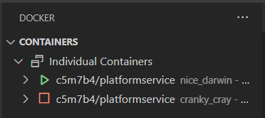

# kubernetes for .net cor apis

firstly we are going to create a blank folder in our dev directory

then we are going to initialize it

```js
npm init -y
```

then let's create a README.md in the root of the directory for our notes.

now we are going to create a file in the root called .gitignore. We'll add stuff to it as we see the need. This is not going to be a typical node project, so we won't use npx gitignore node.

now initial the git repository

```js
git init
git add .
git commit -m "initial commit"
```

then we are going to go ahead and link this up with our github repo. Refresh the page and we should see our readme and our repo should be setup and we are ready to get started.

firstly, we will create our first branch to work off of

```js
git checkout -b branch1
```

## branch 1

This code comes from this awesome [youtube video](https://www.youtube.com/watch?v=DgVjEo3OGBI)

Here we are going to take a look at slides 01 through 03. I am not a powerpoint guy, but I give my best shot:

now we should play through the service architechture powerpoint presention:


now we should play through the platform service Architecture presention:


now we should play through the command service Architecture presentation:


thats it for our introduction into what we are going to build, so let's commit this sad powerpoint work and get to writing some code.

## branch 4

let's get started by creating a few projects

first lets check out version of .NET to make sure everything is cozy, so let's run

```js
dotnet --version
```


for our first project, we are going to run this command

```js
dotnet new webapi -n PlatformService
```

now our folder structure should look something like this:


we can open that folder in vscode by typing

```js
code -r PlatformService
```

now when this opens, you may see a prompt like this:


definately choose yes, becuase this will give you the ability to debug your applications with ease.

now your folder structure inside of platform service should look like this:


the first thing we are going to do with this project is to delete the WeatherForecast.csl file and delete the Controller for that as well.

let's open the PlatformService.csproj file so we can make sure that as we install our dependencies, that they actually get installed. This will be helpfull fo sure. So, let's install some dependencies:

```js
dotnet add package AutoMapper.Extensions.Microsoft.DependencyInjection
dotnet add package Microsoft.EntityFrameworkCore
dotnet add package Microsoft.EntityFrameworkCore.Design
dotnet add package Microsoft.EntityFrameworkCore.InMemory
dotnet add package Microsoft.EntityFrameworkCore.SqlServer
```

now your PlatformService.csproj should look like this:


just for clarity, i'll put the code here are well

```js
<Project Sdk="Microsoft.NET.Sdk.Web">

  <PropertyGroup>
    <TargetFramework>net6.0</TargetFramework>
    <Nullable>enable</Nullable>
    <ImplicitUsings>enable</ImplicitUsings>
  </PropertyGroup>

  <ItemGroup>
    <PackageReference Include="AutoMapper.Extensions.Microsoft.DependencyInjection" Version="12.0.0" />
    <PackageReference Include="Microsoft.EntityFrameworkCore" Version="6.0.10" />
    <PackageReference Include="Microsoft.EntityFrameworkCore.Design" Version="6.0.10">
      <IncludeAssets>runtime; build; native; contentfiles; analyzers; buildtransitive</IncludeAssets>
      <PrivateAssets>all</PrivateAssets>
    </PackageReference>
    <PackageReference Include="Microsoft.EntityFrameworkCore.InMemory" Version="6.0.10" />
    <PackageReference Include="Microsoft.EntityFrameworkCore.SqlServer" Version="6.0.10" />
    <PackageReference Include="Swashbuckle.AspNetCore" Version="6.2.3" />
  </ItemGroup>

</Project>

```

## branch 5

now, create a folder in the root of our project called Models and create a file inside of there called Platform.cs. This is what this file should look like. Its pretty straight forward

as a side note, once your are in a class, you can add properties with the shortcut by just typing prop, and then you will get intellisence which will help you out.


```js
namespace PlatformService.Models
{
  public class Platform
  {
    public int Id { get; set; }
    public string? Name { get; set; }
    public string? Publisher { get; set; }
    public string? Cost { get; set; }
  }
}
```

now we are going to add some annotations to this, but we are going to get some squigglies, so let's take a look at how to fix those squigglies:


so, to fix this, just put the cursor inside of the offending word, and press ctrl-. and you will get some intellisense that will allow you to import the correct using statement that you need.


so, now our class should look like this:

```js
using System.ComponentModel.DataAnnotations;

namespace PlatformService.Models
{
  public class Platform
  {
    [Key]
    [Required]
    public int Id { get; set; }
    [Required]

    public string? Name { get; set; }
    [Required]
    public string? Publisher { get; set; }
    [Required]
    public string? Cost { get; set; }
  }
}
```

now, we are going to create our DbContext. Create a folder in the root of the project called Data and add a file inside of that called AppDbContext.cs

another shortcut that you can use is for creating constructors, so you just basically just type ctor and vscode will help you out. just press tab and vscode will automatically create a constructor for you.


```js
using Microsoft.EntityFrameworkCore;
using PlatformService.Models;

namespace PlatformService.Data
{
  public class AppDbContext : DbContext
  {
    public AppDbContext(DbContextOptions<AppDbContext> opt) : base(opt)
    {

    }

    public DbSet<Platform> Platforms { get; set; }
  }
}
```

then we need to wire this up on our Program.cs file

```js
builder.Services.AddDbContext<AppDbContext>(opt => opt.UseInMemoryDatabase("InMem"));
```

## branch 6

now we are going to add our repository. let's create an interface in the data folder. make a file named IPlatformRepo.cs

```js
using PlatformService.Models;

namespace PlatformService.Data
{
  public interface IPlatformRepo
  {
    bool SaveChanges();

    IEnumerable<Platform> GetAllPlatforms();
    Platform GetPlatformById(int id);
    void CreatePlatform(Platform plat);
  }
}
```

now create the concrete class to inherit from out interface. Create a filed called PlatformRepo.cs in the data folder

one thing you will notice right off, is that vscode is not happy with us:


we can use the same technique by putting the cursor inside of the word IPlatformRepo and pressing ctrl-. to get some intellisense:


after you click on implement interface, vscode will automatically stub out all of the methods that you need in order to fulfill the contract between the two.

it should not look like this:

```js
using PlatformService.Models;

namespace PlatformService.Data
{
  public class PlatformRepo : IPlatformRepo
  {
    public void CreatePlatform(Platform plat)
    {
      throw new NotImplementedException();
    }

    public IEnumerable<Platform> GetAllPlatforms()
    {
      throw new NotImplementedException();
    }

    public Platform GetPlatformById(int id)
    {
      throw new NotImplementedException();
    }

    public bool SaveChanges()
    {
      throw new NotImplementedException();
    }
  }
}
```

let's start to fill this file out. we should start with a constructor first. don't forget about the ctor shortcut

let's look at a stub for this what we will use a lot in the upcoming exercises


to fix this, put the cursor in the _context word and press ctrl-. and select create private read-only field:


let's start at the bottom and fill out this class

```js
    public bool SaveChanges()
    {
      return (_context.SaveChanges() >= 0);
    }
```

```js
    public IEnumerable<Platform> GetAllPlatforms()
    {
      return _context.Platforms.ToList();
    }
```

```js
    public Platform GetPlatformById(int id)
    {
      var platform = _context.Platforms.FirstOrDefault(p => p.Id == id);
      if (platform == null)
      {
        return new Platform { };
      }
      else
      {
        return platform;
      }
    }
```

```js
    public void CreatePlatform(Platform plat)
    {
      if (plat == null)
      {
        throw new ArgumentNullException(nameof(plat));
      }

      _context.Platforms.Add(plat);
    }
```

now our final PlatformRepo.cs should look like this:

```js
using PlatformService.Models;

namespace PlatformService.Data
{
  public class PlatformRepo : IPlatformRepo
  {
    private readonly AppDbContext _context;

    public PlatformRepo(AppDbContext context)
    {
      _context = context;
    }
    public void CreatePlatform(Platform plat)
    {
      if (plat == null)
      {
        throw new ArgumentNullException(nameof(plat));
      }

      _context.Platforms.Add(plat);
    }

    public IEnumerable<Platform> GetAllPlatforms()
    {
      return _context.Platforms.ToList();
    }

    public Platform GetPlatformById(int id)
    {
      var platform = _context.Platforms.FirstOrDefault(p => p.Id == id);
      if (platform == null)
      {
        return new Platform { };
      }
      else
      {
        return platform;
      }
    }

    public bool SaveChanges()
    {
      return (_context.SaveChanges() >= 0);
    }
  }
}
```

inn order to be able to inject this into our constructors, we need to register this with our Program.cs file. This is an important step in the process:

so, in Program.cs, add this little snippet of code:

```js
builder.Services.AddScoped<IPlatformRepo, PlatformRepo>();
```

now, just to keep things tidy, we are going to make sure that our project builds:

```js
dotnet build
```

now, you may see a warning here, but we'll take care of that later on:


before we commit this, we need to add some stuff to our gitignore, because right now there appears to be a lot of files to commit. first let's check to see where they are coming from:

add this to the .gitignore file

```js
bin
obj
```

ok, now we can commit this branch before we move on

## branch 7

now we are going to seed out in-memory database so create a file in the Data folder called PrepDb.cs

let's just stub out the start of this file so we can add it to our Program.cs file:

```js
namespace PlatformService.Data
{
  public static class PrepDb
  {
    public static void PrepPopulation(IApplicationBuilder app, bool isProd)
    {

    }
  }
}
```

then in our Program.cs file, let's add this snippet just before the app.Run() command:

```js
PrepDb.PrepPopulation(app, app.Environment.IsProduction());
```

At first, our file looks like this:


so, lets get rid of that warning. go into the PlatformService.csproj file and commend out this line


now you wll see that this error will go away

new this file should look like this:

```js
using PlatformService.Models;

namespace PlatformService.Data
{
  public static class PrepDb
  {
    public static void PrepPopulation(IApplicationBuilder app, bool isProd)
    {
      using (var serviceScope = app.ApplicationServices.CreateScope())
      {
        SeedData(serviceScope.ServiceProvider.GetService<AppDbContext>(), isProd);
      }
    }

    private static void SeedData(AppDbContext context, bool isProd)
    {
      if (!context.Platforms.Any())
      {
        Console.WriteLine("--> Seeding Data...");
        context.Platforms.AddRange(
          new Platform() { Name = "Dot Net", Publisher = "Microsoft", Cost = "Free" },
          new Platform() { Name = "SQL Server Express", Publisher = "Microsoft", Cost = "Free" },
          new Platform() { Name = "Kubernetes", Publisher = "Cloud Native Computing Foundation", Cost = "Free" }
        );

        context.SaveChanges();
      }
      else
      {
        Console.WriteLine("--> we already have data");
      }
    }
  }
}
```

now just for safety, lets run a build

```js
dotnet build
```

everything should be good. oh wait, i noticed we got a lot of nullable warnings so lets go back to our Platform.cs class in the models folder and remove the ? character


now let's run this command

```js
dotnet build
```

and we should see this:


we want to make sure that we are seeing the Seeding Data in our console.

## branch 8

now we are going to create some DTOs {Data Transformation Object}

so, lets create another folder in the root of our project called Dtos and create a file inside of that called PlatformReadDto.cs

```js
namespace PlatformService.Dtos
{
  public class PlatformReadDto
  {
    public int Id { get; set; }

    public string Name { get; set; }

    public string Publisher { get; set; }

    public string Cost { get; set; }
  }
}
```

now let's create another Dto called PlatformCreateDto.cs

```js
using System.ComponentModel.DataAnnotations;

namespace PlatformService.Dtos
{
  public class PlatformCreateDto
  {
    [Required]
    public string Name { get; set; }
    [Required]
    public string Publisher { get; set; }
    [Required]
    public string Cost { get; set; }
  }
}
```

so now we have our Dtos, but we need a way to map these to our model.
let's commit what we have and in the next branch, we will create our mappers.

## branch 9

firstly, we need to register AutoMapper so in the Progam.cs file, we need to add this snippet:

```js
builder.Services.AddAutoMapper(AppDomain.CurrentDomain.GetAssemblies());
```

in the root of our project, we are going to create a new folder called Profiles and in there we are going to create a new file called PlatformProfiles.cs

```js
using AutoMapper;
using PlatformService.Dtos;
using PlatformService.Models;

namespace PlatformService.Profiles
{
  public class PlatformProfile : Profile
  {
    public PlatformProfile()
    {
      // source -> target
      CreateMap<Platform, PlatformReadDto>();
      CreateMap<PlatformCreateDto, Platform>();
    }
  }
}
```

now let's make sure we don't have any errors, so we'll do a run

```js
dotnet run
```

## branch 10

now we are going to create our controller for this app, so let's create a file called PlatformsController.cs in the Controllers folder.

```js
using AutoMapper;
using Microsoft.AspNetCore.Mvc;
using PlatformService.Data;
using PlatformService.Dtos;

namespace PlatformService.Controllers
{
  [Route("api/Platforms")]
  [ApiController]
  public class PlatformsController : ControllerBase
  {
    private readonly IMapper _mapper;
    private readonly IPlatformRepo _repo;

    public PlatformsController(IPlatformRepo repo, IMapper mapper)
    {
      _repo = repo;
      _mapper = mapper;
    }

    public ActionResult<IEnumerable<PlatformReadDto>> GetPlatforms()
    {
      Console.WriteLine("--> Getting Platforms");

      var platformItem = _repo.GetAllPlatforms();

      return Ok(_mapper.Map<IEnumerable<PlatformReadDto>>(platformItem));
    }
  }
}
```

now let's test everythig out up to this point, so we'll run ths command

```js
dotnet run
```

now we can actually test our work finally. We are going to use insomnia to test our api. here is the link to the [app](https://insomnia.rest/) or you can just type insomnia app into your brower and find the download

once that is loaded, we are going to go to the dashboard and create a new project:


now we have a clean slate to work with for this project

let create a new folder for this project:


and we are going to call this new folder PlatformService

now we are going to create a new request to test out our service:


now we need to figure out where our request needs to come from:


so, let's just fix this up by changing our ports, so open up Properties/luanchSettings.json and change the port to look like this:

```js
"applicationUrl": "https://localhost:5001;http://localhost:5000",
```

now let's re-run the application

```js
dotnet run
```

and we should see the ports change


now we are going to rename that request to 'Get all Platforms' and we are going to make it look like this:


we have our first successfull endpoint. let's move on shall we.

now let's add an endpoint for getting a platform by it's id

```js
    [HttpGet("{id}",Name = "GetPlatformById")]
    public ActionResult<PlatformReadDto> GetPlatformById(int id)
    {
      var platformItem = _repo.GetPlatformById(id);

      if (platformItem != null)
      {
        return Ok(_mapper.Map<PlatformReadDto>(platformItem));
      }
      else
      {
        return NotFound();
      }
    }
```

let's spin it up and give that a try

```js
dotnet run
```

now in insomnia, let's test our request like this:


everything is working well, so we need one more endpoint, then on to docker and then on to kubernetes. so, let's add that final endpoint to create a new platform

```js
    [HttpPost]
    public ActionResult<PlatformReadDto> CreatePlatform(PlatformCreateDto platformCreateDto)
    {
      var platformModel = _mapper.Map<Platform>(platformCreateDto);
      _repo.CreatePlatform(platformModel);
      _repo.SaveChanges();

      var platformReadDto = _mapper.Map<PlatformReadDto>(platformModel);

      return CreatedAtRoute(nameof(GetPlatformById), new { Id = platformReadDto.Id }, platformReadDto);
    }
```

now let's test it out

```js
dotnet run
```

and in insomnia, let's create a test like this:
one note, for this request, because it's going to be a post, we need to tell insomnia that we have a json body


we can also look at the headers to see the location parameter


now if we run our Get all Platforms again, we should see our new platform


before we wrap up this branch, let's take a look at debugging our app, as that is very important when things don't go as planned. To do this, let's look at the debug section of vscode.


hit the play button and run that endpoint in insomnia, and you should see the code break:


we can also see that our app is running on two different ports:


let's take a look at our swagger documentation


## branch 11

make sure you have docker desktop running firstly:


now make sure to install the plugin into vscode


in the root of our project create a file called Dockerfile

here is how i am finding the image:


```js
FROM mcr.microsoft.com/dotnet/sdk:6.0 AS build-env

WORKDIR /app

COPY *.csproj ./

RUN dotnet restore

COPY . ./

RUN dotnet publish -c Release -o out

FROM mcr.microsoft.com/dotnet/aspnet:6.0

WORKDIR /app

COPY --from=build-env /app/out .

ENTRYPOINT ["dotnet", "PlatformService.dll"]
```

make sure the filename matches with whats in the bin directory


now let's check our version of docker


let's now open up the Docker Desktop app and check to make sure that we have kubernetes enabled:


now let's build our first docker file

```js
docker build -t c5m7b4/platformservice .
```

be sure to use your docker hub username instead of mine and don't forget the period at the end, because that is the directory that it need to look to to find the Dockerfile. now your bash is going to go crazy, so no worries there and after it finishes doing all its work, you should be able to see your new image:


and you should also be able to see it in the Docker Desktop app:


let's spin up our image and give it a test run

```js
docker run -p 8080:80 -d  c5m7b4/platformservice
```


firstly, you should get a hash back letting us know our image is running, and you should also be able to see that the container is running in the Docker plugin in vscode. there are a few more things that we can do also

```js
docker ps
```

this will show us all running containers


if you want to see all containers that you might have that are not running, you can try this command

```js
docker ps -a
```

if you want to see all images that you've created

```js
docker images
```

you can also stop the container by using it's id

```js
docker stop 
```

sometimes it takes a little time to stop the container

one thing to note is that if we run the container again using the same command as before:

```js
docker run -p 8080:80 -d  c5m7b4/platformservice
```



notice that now, we have two of these containers.

so let's run docker ps again and get the container id so we can stop it


```js
docker stop 2224fc5941c3
```

so, to start a stopped container, use the id that was created for your

```js
docker start 2224fc5941c3
```

you can also use the plugin


now we are going to push our image up to docker hub. I'm not sure, but I think you have to do a docker login first, and then after that it should remember your credentials:

```js
docker push c5m7b4/platformservice
```

this will take a few minutes, but after it's finished, we can log into dockerhub and see our new image which we will need for kubernetes


next up, we'll test out our container