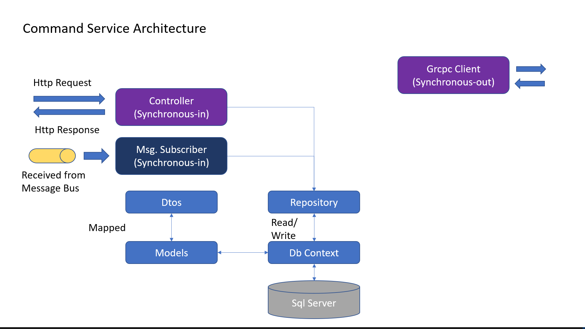

# kubernetes for .net cor apis

firstly we are going to create a blank folder in our dev directory

then we are going to initialize it

```js
npm init -y
```

then let's create a README.md in the root of the directory for our notes.

now we are going to create a file in the root called .gitignore. We'll add stuff to it as we see the need. This is not going to be a typical node project, so we won't use npx gitignore node.

now initial the git repository

```js
git init
git add .
git commit -m "initial commit"
```

then we are going to go ahead and link this up with our github repo. Refresh the page and we should see our readme and our repo should be setup and we are ready to get started.

firstly, we will create our first branch to work off of

```js
git checkout -b branch1
```

## branch 1

This code comes from this awesome [youtube video](https://www.youtube.com/watch?v=DgVjEo3OGBI)

Here we are going to take a look at slides 01 through 03. I am not a powerpoint guy, but I give my best shot:

now we should play through the service architechture powerpoint presention:


now we should play through the platform service Architecture presention:


now we should play through the command service Architecture presentation:



thats it for our introduction into what we are going to build, so let's commit this sad powerpoint work and get to writing some code.

## branch 4

let's get started by creating a few projects

first lets check out version of .NET to make sure everything is cozy, so let's run

```js
dotnet --version
```


for our first project, we are going to run this command

```js
dotnet new webapi -n PlatformService
```

now our folder structure should look something like this:


we can open that folder in vscode by typing

```js
code -r PlatformService
```

now when this opens, you may see a prompt like this:


definately choose yes, becuase this will give you the ability to debug your applications with ease.

now your folder structure inside of platform service should look like this:


the first thing we are going to do with this project is to delete the WeatherForecast.csl file and delete the Controller for that as well.

let's open the PlatformService.csproj file so we can make sure that as we install our dependencies, that they actually get installed. This will be helpfull fo sure. So, let's install some dependencies:

```js
dotnet add package AutoMapper.Extensions.Microsoft.DependencyInjection
dotnet add package Microsoft.EntityFrameworkCore
dotnet add package Microsoft.EntityFrameworkCore.Design
dotnet add package Microsoft.EntityFrameworkCore.InMemory
dotnet add package Microsoft.EntityFrameworkCore.SqlServer
```

now your PlatformService.csproj should look like this:


just for clarity, i'll put the code here are well

```js
<Project Sdk="Microsoft.NET.Sdk.Web">

  <PropertyGroup>
    <TargetFramework>net6.0</TargetFramework>
    <Nullable>enable</Nullable>
    <ImplicitUsings>enable</ImplicitUsings>
  </PropertyGroup>

  <ItemGroup>
    <PackageReference Include="AutoMapper.Extensions.Microsoft.DependencyInjection" Version="12.0.0" />
    <PackageReference Include="Microsoft.EntityFrameworkCore" Version="6.0.10" />
    <PackageReference Include="Microsoft.EntityFrameworkCore.Design" Version="6.0.10">
      <IncludeAssets>runtime; build; native; contentfiles; analyzers; buildtransitive</IncludeAssets>
      <PrivateAssets>all</PrivateAssets>
    </PackageReference>
    <PackageReference Include="Microsoft.EntityFrameworkCore.InMemory" Version="6.0.10" />
    <PackageReference Include="Microsoft.EntityFrameworkCore.SqlServer" Version="6.0.10" />
    <PackageReference Include="Swashbuckle.AspNetCore" Version="6.2.3" />
  </ItemGroup>

</Project>

```

## branch 5

now, create a folder in the root of our project called Models and create a file inside of there called Platform.cs. This is what this file should look like. Its pretty straight forward

as a side note, once your are in a class, you can add properties with the shortcut by just typing prop, and then you will get intellisence which will help you out.


```js
namespace PlatformService.Models
{
  public class Platform
  {
    public int Id { get; set; }
    public string? Name { get; set; }
    public string? Publisher { get; set; }
    public string? Cost { get; set; }
  }
}
```

now we are going to add some annotations to this, but we are going to get some squigglies, so let's take a look at how to fix those squigglies:


so, to fix this, just put the cursor inside of the offending word, and press ctrl-. and you will get some intellisense that will allow you to import the correct using statement that you need.


so, now our class should look like this:

```js
using System.ComponentModel.DataAnnotations;

namespace PlatformService.Models
{
  public class Platform
  {
    [Key]
    [Required]
    public int Id { get; set; }
    [Required]

    public string? Name { get; set; }
    [Required]
    public string? Publisher { get; set; }
    [Required]
    public string? Cost { get; set; }
  }
}
```

now, we are going to create our DbContext. Create a folder in the root of the project called Data and add a file inside of that called AppDbContext.cs

another shortcut that you can use is for creating constructors, so you just basically just type ctor and vscode will help you out. just press tab and vscode will automatically create a constructor for you.


```js
using Microsoft.EntityFrameworkCore;
using PlatformService.Models;

namespace PlatformService.Data
{
  public class AppDbContext : DbContext
  {
    public AppDbContext(DbContextOptions<AppDbContext> opt) : base(opt)
    {

    }

    public DbSet<Platform> Platforms { get; set; }
  }
}
```

then we need to wire this up on our Program.cs file

```js
builder.Services.AddDbContext<AppDbContext>(opt => opt.UseInMemoryDatabase("InMem"));
```

## branch 6

now we are going to add our repository. let's create an interface in the data folder. make a file named IPlatformRepo.cs

```js
using PlatformService.Models;

namespace PlatformService.Data
{
  public interface IPlatformRepo
  {
    bool SaveChanges();

    IEnumerable<Platform> GetAllPlatforms();
    Platform GetPlatformById(int id);
    void CreatePlatform(Platform plat);
  }
}
```

now create the concrete class to inherit from out interface. Create a filed called PlatformRepo.cs in the data folder

one thing you will notice right off, is that vscode is not happy with us:


we can use the same technique by putting the cursor inside of the word IPlatformRepo and pressing ctrl-. to get some intellisense:


after you click on implement interface, vscode will automatically stub out all of the methods that you need in order to fulfill the contract between the two.

it should not look like this:

```js
using PlatformService.Models;

namespace PlatformService.Data
{
  public class PlatformRepo : IPlatformRepo
  {
    public void CreatePlatform(Platform plat)
    {
      throw new NotImplementedException();
    }

    public IEnumerable<Platform> GetAllPlatforms()
    {
      throw new NotImplementedException();
    }

    public Platform GetPlatformById(int id)
    {
      throw new NotImplementedException();
    }

    public bool SaveChanges()
    {
      throw new NotImplementedException();
    }
  }
}
```

let's start to fill this file out. we should start with a constructor first. don't forget about the ctor shortcut

let's look at a stub for this what we will use a lot in the upcoming exercises


to fix this, put the cursor in the _context word and press ctrl-. and select create private read-only field:


let's start at the bottom and fill out this class

```js
    public bool SaveChanges()
    {
      return (_context.SaveChanges() >= 0);
    }
```

```js
    public IEnumerable<Platform> GetAllPlatforms()
    {
      return _context.Platforms.ToList();
    }
```

```js
    public Platform GetPlatformById(int id)
    {
      var platform = _context.Platforms.FirstOrDefault(p => p.Id == id);
      if (platform == null)
      {
        return new Platform { };
      }
      else
      {
        return platform;
      }
    }
```

```js
    public void CreatePlatform(Platform plat)
    {
      if (plat == null)
      {
        throw new ArgumentNullException(nameof(plat));
      }

      _context.Platforms.Add(plat);
    }
```

now our final PlatformRepo.cs should look like this:

```js
using PlatformService.Models;

namespace PlatformService.Data
{
  public class PlatformRepo : IPlatformRepo
  {
    private readonly AppDbContext _context;

    public PlatformRepo(AppDbContext context)
    {
      _context = context;
    }
    public void CreatePlatform(Platform plat)
    {
      if (plat == null)
      {
        throw new ArgumentNullException(nameof(plat));
      }

      _context.Platforms.Add(plat);
    }

    public IEnumerable<Platform> GetAllPlatforms()
    {
      return _context.Platforms.ToList();
    }

    public Platform GetPlatformById(int id)
    {
      var platform = _context.Platforms.FirstOrDefault(p => p.Id == id);
      if (platform == null)
      {
        return new Platform { };
      }
      else
      {
        return platform;
      }
    }

    public bool SaveChanges()
    {
      return (_context.SaveChanges() >= 0);
    }
  }
}
```

inn order to be able to inject this into our constructors, we need to register this with our Program.cs file. This is an important step in the process:

so, in Program.cs, add this little snippet of code:

```js
builder.Services.AddScoped<IPlatformRepo, PlatformRepo>();
```

now, just to keep things tidy, we are going to make sure that our project builds:

```js
dotnet build
```

now, you may see a warning here, but we'll take care of that later on:


before we commit this, we need to add some stuff to our gitignore, because right now there appears to be a lot of files to commit. first let's check to see where they are coming from:

add this to the .gitignore file

```js
bin
obj
```

ok, now we can commit this branch before we move on

## branch 7

now we are going to seed out in-memory database so create a file in the Data folder called PrepDb.cs

let's just stub out the start of this file so we can add it to our Program.cs file:

```js
namespace PlatformService.Data
{
  public static class PrepDb
  {
    public static void PrepPopulation(IApplicationBuilder app, bool isProd)
    {

    }
  }
}
```

then in our Program.cs file, let's add this snippet just before the app.Run() command:

```js
PrepDb.PrepPopulation(app, app.Environment.IsProduction());
```

At first, our file looks like this:


so, lets get rid of that warning. go into the PlatformService.csproj file and commend out this line


now you wll see that this error will go away

new this file should look like this:

```js
using PlatformService.Models;

namespace PlatformService.Data
{
  public static class PrepDb
  {
    public static void PrepPopulation(IApplicationBuilder app, bool isProd)
    {
      using (var serviceScope = app.ApplicationServices.CreateScope())
      {
        SeedData(serviceScope.ServiceProvider.GetService<AppDbContext>(), isProd);
      }
    }

    private static void SeedData(AppDbContext context, bool isProd)
    {
      if (!context.Platforms.Any())
      {
        Console.WriteLine("--> Seeding Data...");
        context.Platforms.AddRange(
          new Platform() { Name = "Dot Net", Publisher = "Microsoft", Cost = "Free" },
          new Platform() { Name = "SQL Server Express", Publisher = "Microsoft", Cost = "Free" },
          new Platform() { Name = "Kubernetes", Publisher = "Cloud Native Computing Foundation", Cost = "Free" }
        );

        context.SaveChanges();
      }
      else
      {
        Console.WriteLine("--> we already have data");
      }
    }
  }
}
```

now just for safety, lets run a build

```js
dotnet build
```

everything should be good. oh wait, i noticed we got a lot of nullable warnings so lets go back to our Platform.cs class in the models folder and remove the ? character


now let's run this command

```js
dotnet build
```

and we should see this:


we want to make sure that we are seeing the Seeding Data in our console.

## branch 8

now we are going to create some DTOs {Data Transformation Object}

so, lets create another folder in the root of our project called Dtos and create a file inside of that called PlatformReadDto.cs

```js
namespace PlatformService.Dtos
{
  public class PlatformReadDto
  {
    public int Id { get; set; }

    public string Name { get; set; }

    public string Publisher { get; set; }

    public string Cost { get; set; }
  }
}
```

now let's create another Dto called PlatformCreateDto.cs

```js
using System.ComponentModel.DataAnnotations;

namespace PlatformService.Dtos
{
  public class PlatformCreateDto
  {
    [Required]
    public string Name { get; set; }
    [Required]
    public string Publisher { get; set; }
    [Required]
    public string Cost { get; set; }
  }
}
```

so now we have our Dtos, but we need a way to map these to our model.
let's commit what we have and in the next branch, we will create our mappers.

