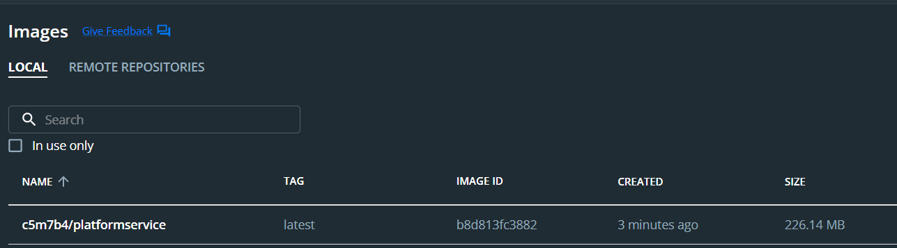
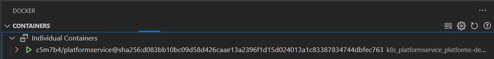
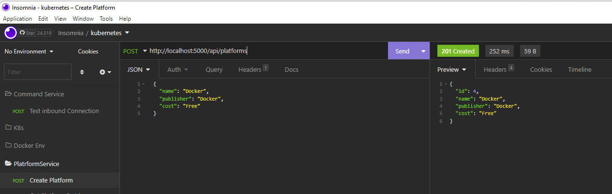

# kubernetes for .net cor apis

firstly we are going to create a blank folder in our dev directory

then we are going to initialize it

```js
npm init -y
```

then let's create a README.md in the root of the directory for our notes.

now we are going to create a file in the root called .gitignore. We'll add stuff to it as we see the need. This is not going to be a typical node project, so we won't use npx gitignore node.

now initial the git repository

```js
git init
git add .
git commit -m "initial commit"
```

then we are going to go ahead and link this up with our github repo. Refresh the page and we should see our readme and our repo should be setup and we are ready to get started.

firstly, we will create our first branch to work off of

```js
git checkout -b branch1
```

## branch 1

This code comes from this awesome [youtube video](https://www.youtube.com/watch?v=DgVjEo3OGBI)

Here we are going to take a look at slides 01 through 03. I am not a powerpoint guy, but I give my best shot:

now we should play through the service architechture powerpoint presention:


now we should play through the platform service Architecture presention:


now we should play through the command service Architecture presentation:


thats it for our introduction into what we are going to build, so let's commit this sad powerpoint work and get to writing some code.

## branch 4

let's get started by creating a few projects

first lets check out version of .NET to make sure everything is cozy, so let's run

```js
dotnet --version
```


for our first project, we are going to run this command

```js
dotnet new webapi -n PlatformService
```

now our folder structure should look something like this:


we can open that folder in vscode by typing

```js
code -r PlatformService
```

now when this opens, you may see a prompt like this:


definately choose yes, becuase this will give you the ability to debug your applications with ease.

now your folder structure inside of platform service should look like this:


the first thing we are going to do with this project is to delete the WeatherForecast.csl file and delete the Controller for that as well.

let's open the PlatformService.csproj file so we can make sure that as we install our dependencies, that they actually get installed. This will be helpfull fo sure. So, let's install some dependencies:

```js
dotnet add package AutoMapper.Extensions.Microsoft.DependencyInjection
dotnet add package Microsoft.EntityFrameworkCore
dotnet add package Microsoft.EntityFrameworkCore.Design
dotnet add package Microsoft.EntityFrameworkCore.InMemory
dotnet add package Microsoft.EntityFrameworkCore.SqlServer
```

now your PlatformService.csproj should look like this:


just for clarity, i'll put the code here are well

```js
<Project Sdk="Microsoft.NET.Sdk.Web">

  <PropertyGroup>
    <TargetFramework>net6.0</TargetFramework>
    <Nullable>enable</Nullable>
    <ImplicitUsings>enable</ImplicitUsings>
  </PropertyGroup>

  <ItemGroup>
    <PackageReference Include="AutoMapper.Extensions.Microsoft.DependencyInjection" Version="12.0.0" />
    <PackageReference Include="Microsoft.EntityFrameworkCore" Version="6.0.10" />
    <PackageReference Include="Microsoft.EntityFrameworkCore.Design" Version="6.0.10">
      <IncludeAssets>runtime; build; native; contentfiles; analyzers; buildtransitive</IncludeAssets>
      <PrivateAssets>all</PrivateAssets>
    </PackageReference>
    <PackageReference Include="Microsoft.EntityFrameworkCore.InMemory" Version="6.0.10" />
    <PackageReference Include="Microsoft.EntityFrameworkCore.SqlServer" Version="6.0.10" />
    <PackageReference Include="Swashbuckle.AspNetCore" Version="6.2.3" />
  </ItemGroup>

</Project>

```

## branch 5

now, create a folder in the root of our project called Models and create a file inside of there called Platform.cs. This is what this file should look like. Its pretty straight forward

as a side note, once your are in a class, you can add properties with the shortcut by just typing prop, and then you will get intellisence which will help you out.


```js
namespace PlatformService.Models
{
  public class Platform
  {
    public int Id { get; set; }
    public string? Name { get; set; }
    public string? Publisher { get; set; }
    public string? Cost { get; set; }
  }
}
```

now we are going to add some annotations to this, but we are going to get some squigglies, so let's take a look at how to fix those squigglies:


so, to fix this, just put the cursor inside of the offending word, and press ctrl-. and you will get some intellisense that will allow you to import the correct using statement that you need.


so, now our class should look like this:

```js
using System.ComponentModel.DataAnnotations;

namespace PlatformService.Models
{
  public class Platform
  {
    [Key]
    [Required]
    public int Id { get; set; }
    [Required]

    public string? Name { get; set; }
    [Required]
    public string? Publisher { get; set; }
    [Required]
    public string? Cost { get; set; }
  }
}
```

now, we are going to create our DbContext. Create a folder in the root of the project called Data and add a file inside of that called AppDbContext.cs

another shortcut that you can use is for creating constructors, so you just basically just type ctor and vscode will help you out. just press tab and vscode will automatically create a constructor for you.


```js
using Microsoft.EntityFrameworkCore;
using PlatformService.Models;

namespace PlatformService.Data
{
  public class AppDbContext : DbContext
  {
    public AppDbContext(DbContextOptions<AppDbContext> opt) : base(opt)
    {

    }

    public DbSet<Platform> Platforms { get; set; }
  }
}
```

then we need to wire this up on our Program.cs file

```js
builder.Services.AddDbContext<AppDbContext>(opt => opt.UseInMemoryDatabase("InMem"));
```

## branch 6

now we are going to add our repository. let's create an interface in the data folder. make a file named IPlatformRepo.cs

```js
using PlatformService.Models;

namespace PlatformService.Data
{
  public interface IPlatformRepo
  {
    bool SaveChanges();

    IEnumerable<Platform> GetAllPlatforms();
    Platform GetPlatformById(int id);
    void CreatePlatform(Platform plat);
  }
}
```

now create the concrete class to inherit from out interface. Create a filed called PlatformRepo.cs in the data folder

one thing you will notice right off, is that vscode is not happy with us:


we can use the same technique by putting the cursor inside of the word IPlatformRepo and pressing ctrl-. to get some intellisense:


after you click on implement interface, vscode will automatically stub out all of the methods that you need in order to fulfill the contract between the two.

it should not look like this:

```js
using PlatformService.Models;

namespace PlatformService.Data
{
  public class PlatformRepo : IPlatformRepo
  {
    public void CreatePlatform(Platform plat)
    {
      throw new NotImplementedException();
    }

    public IEnumerable<Platform> GetAllPlatforms()
    {
      throw new NotImplementedException();
    }

    public Platform GetPlatformById(int id)
    {
      throw new NotImplementedException();
    }

    public bool SaveChanges()
    {
      throw new NotImplementedException();
    }
  }
}
```

let's start to fill this file out. we should start with a constructor first. don't forget about the ctor shortcut

let's look at a stub for this what we will use a lot in the upcoming exercises


to fix this, put the cursor in the _context word and press ctrl-. and select create private read-only field:


let's start at the bottom and fill out this class

```js
    public bool SaveChanges()
    {
      return (_context.SaveChanges() >= 0);
    }
```

```js
    public IEnumerable<Platform> GetAllPlatforms()
    {
      return _context.Platforms.ToList();
    }
```

```js
    public Platform GetPlatformById(int id)
    {
      var platform = _context.Platforms.FirstOrDefault(p => p.Id == id);
      if (platform == null)
      {
        return new Platform { };
      }
      else
      {
        return platform;
      }
    }
```

```js
    public void CreatePlatform(Platform plat)
    {
      if (plat == null)
      {
        throw new ArgumentNullException(nameof(plat));
      }

      _context.Platforms.Add(plat);
    }
```

now our final PlatformRepo.cs should look like this:

```js
using PlatformService.Models;

namespace PlatformService.Data
{
  public class PlatformRepo : IPlatformRepo
  {
    private readonly AppDbContext _context;

    public PlatformRepo(AppDbContext context)
    {
      _context = context;
    }
    public void CreatePlatform(Platform plat)
    {
      if (plat == null)
      {
        throw new ArgumentNullException(nameof(plat));
      }

      _context.Platforms.Add(plat);
    }

    public IEnumerable<Platform> GetAllPlatforms()
    {
      return _context.Platforms.ToList();
    }

    public Platform GetPlatformById(int id)
    {
      var platform = _context.Platforms.FirstOrDefault(p => p.Id == id);
      if (platform == null)
      {
        return new Platform { };
      }
      else
      {
        return platform;
      }
    }

    public bool SaveChanges()
    {
      return (_context.SaveChanges() >= 0);
    }
  }
}
```

inn order to be able to inject this into our constructors, we need to register this with our Program.cs file. This is an important step in the process:

so, in Program.cs, add this little snippet of code:

```js
builder.Services.AddScoped<IPlatformRepo, PlatformRepo>();
```

now, just to keep things tidy, we are going to make sure that our project builds:

```js
dotnet build
```

now, you may see a warning here, but we'll take care of that later on:


before we commit this, we need to add some stuff to our gitignore, because right now there appears to be a lot of files to commit. first let's check to see where they are coming from:

add this to the .gitignore file

```js
bin
obj
```

ok, now we can commit this branch before we move on

## branch 7

now we are going to seed out in-memory database so create a file in the Data folder called PrepDb.cs

let's just stub out the start of this file so we can add it to our Program.cs file:

```js
namespace PlatformService.Data
{
  public static class PrepDb
  {
    public static void PrepPopulation(IApplicationBuilder app, bool isProd)
    {

    }
  }
}
```

then in our Program.cs file, let's add this snippet just before the app.Run() command:

```js
PrepDb.PrepPopulation(app, app.Environment.IsProduction());
```

At first, our file looks like this:


so, lets get rid of that warning. go into the PlatformService.csproj file and commend out this line


now you wll see that this error will go away

new this file should look like this:

```js
using PlatformService.Models;

namespace PlatformService.Data
{
  public static class PrepDb
  {
    public static void PrepPopulation(IApplicationBuilder app, bool isProd)
    {
      using (var serviceScope = app.ApplicationServices.CreateScope())
      {
        SeedData(serviceScope.ServiceProvider.GetService<AppDbContext>(), isProd);
      }
    }

    private static void SeedData(AppDbContext context, bool isProd)
    {
      if (!context.Platforms.Any())
      {
        Console.WriteLine("--> Seeding Data...");
        context.Platforms.AddRange(
          new Platform() { Name = "Dot Net", Publisher = "Microsoft", Cost = "Free" },
          new Platform() { Name = "SQL Server Express", Publisher = "Microsoft", Cost = "Free" },
          new Platform() { Name = "Kubernetes", Publisher = "Cloud Native Computing Foundation", Cost = "Free" }
        );

        context.SaveChanges();
      }
      else
      {
        Console.WriteLine("--> we already have data");
      }
    }
  }
}
```

now just for safety, lets run a build

```js
dotnet build
```

everything should be good. oh wait, i noticed we got a lot of nullable warnings so lets go back to our Platform.cs class in the models folder and remove the ? character


now let's run this command

```js
dotnet build
```

and we should see this:


we want to make sure that we are seeing the Seeding Data in our console.

## branch 8

now we are going to create some DTOs {Data Transformation Object}

so, lets create another folder in the root of our project called Dtos and create a file inside of that called PlatformReadDto.cs

```js
namespace PlatformService.Dtos
{
  public class PlatformReadDto
  {
    public int Id { get; set; }

    public string Name { get; set; }

    public string Publisher { get; set; }

    public string Cost { get; set; }
  }
}
```

now let's create another Dto called PlatformCreateDto.cs

```js
using System.ComponentModel.DataAnnotations;

namespace PlatformService.Dtos
{
  public class PlatformCreateDto
  {
    [Required]
    public string Name { get; set; }
    [Required]
    public string Publisher { get; set; }
    [Required]
    public string Cost { get; set; }
  }
}
```

so now we have our Dtos, but we need a way to map these to our model.
let's commit what we have and in the next branch, we will create our mappers.

## branch 9

firstly, we need to register AutoMapper so in the Progam.cs file, we need to add this snippet:

```js
builder.Services.AddAutoMapper(AppDomain.CurrentDomain.GetAssemblies());
```

in the root of our project, we are going to create a new folder called Profiles and in there we are going to create a new file called PlatformProfiles.cs

```js
using AutoMapper;
using PlatformService.Dtos;
using PlatformService.Models;

namespace PlatformService.Profiles
{
  public class PlatformProfile : Profile
  {
    public PlatformProfile()
    {
      // source -> target
      CreateMap<Platform, PlatformReadDto>();
      CreateMap<PlatformCreateDto, Platform>();
    }
  }
}
```

now let's make sure we don't have any errors, so we'll do a run

```js
dotnet run
```

## branch 10

now we are going to create our controller for this app, so let's create a file called PlatformsController.cs in the Controllers folder.

```js
using AutoMapper;
using Microsoft.AspNetCore.Mvc;
using PlatformService.Data;
using PlatformService.Dtos;

namespace PlatformService.Controllers
{
  [Route("api/Platforms")]
  [ApiController]
  public class PlatformsController : ControllerBase
  {
    private readonly IMapper _mapper;
    private readonly IPlatformRepo _repo;

    public PlatformsController(IPlatformRepo repo, IMapper mapper)
    {
      _repo = repo;
      _mapper = mapper;
    }

    public ActionResult<IEnumerable<PlatformReadDto>> GetPlatforms()
    {
      Console.WriteLine("--> Getting Platforms");

      var platformItem = _repo.GetAllPlatforms();

      return Ok(_mapper.Map<IEnumerable<PlatformReadDto>>(platformItem));
    }
  }
}
```

now let's test everythig out up to this point, so we'll run ths command

```js
dotnet run
```

now we can actually test our work finally. We are going to use insomnia to test our api. here is the link to the [app](https://insomnia.rest/) or you can just type insomnia app into your brower and find the download

once that is loaded, we are going to go to the dashboard and create a new project:


now we have a clean slate to work with for this project

let create a new folder for this project:


and we are going to call this new folder PlatformService

now we are going to create a new request to test out our service:


now we need to figure out where our request needs to come from:


so, let's just fix this up by changing our ports, so open up Properties/luanchSettings.json and change the port to look like this:

```js
"applicationUrl": "https://localhost:5001;http://localhost:5000",
```

now let's re-run the application

```js
dotnet run
```

and we should see the ports change


now we are going to rename that request to 'Get all Platforms' and we are going to make it look like this:


we have our first successfull endpoint. let's move on shall we.

now let's add an endpoint for getting a platform by it's id

```js
    [HttpGet("{id}",Name = "GetPlatformById")]
    public ActionResult<PlatformReadDto> GetPlatformById(int id)
    {
      var platformItem = _repo.GetPlatformById(id);

      if (platformItem != null)
      {
        return Ok(_mapper.Map<PlatformReadDto>(platformItem));
      }
      else
      {
        return NotFound();
      }
    }
```

let's spin it up and give that a try

```js
dotnet run
```

now in insomnia, let's test our request like this:


everything is working well, so we need one more endpoint, then on to docker and then on to kubernetes. so, let's add that final endpoint to create a new platform

```js
    [HttpPost]
    public ActionResult<PlatformReadDto> CreatePlatform(PlatformCreateDto platformCreateDto)
    {
      var platformModel = _mapper.Map<Platform>(platformCreateDto);
      _repo.CreatePlatform(platformModel);
      _repo.SaveChanges();

      var platformReadDto = _mapper.Map<PlatformReadDto>(platformModel);

      return CreatedAtRoute(nameof(GetPlatformById), new { Id = platformReadDto.Id }, platformReadDto);
    }
```

now let's test it out

```js
dotnet run
```

and in insomnia, let's create a test like this:
one note, for this request, because it's going to be a post, we need to tell insomnia that we have a json body


we can also look at the headers to see the location parameter


now if we run our Get all Platforms again, we should see our new platform


before we wrap up this branch, let's take a look at debugging our app, as that is very important when things don't go as planned. To do this, let's look at the debug section of vscode.


hit the play button and run that endpoint in insomnia, and you should see the code break:


we can also see that our app is running on two different ports:


let's take a look at our swagger documentation


## branch 11

make sure you have docker desktop running firstly:


now make sure to install the plugin into vscode


in the root of our project create a file called Dockerfile

here is how i am finding the image:


```js
FROM mcr.microsoft.com/dotnet/sdk:6.0 AS build-env

WORKDIR /app

COPY *.csproj ./

RUN dotnet restore

COPY . ./

RUN dotnet publish -c Release -o out

FROM mcr.microsoft.com/dotnet/aspnet:6.0

WORKDIR /app

COPY --from=build-env /app/out .

ENTRYPOINT ["dotnet", "PlatformService.dll"]
```

make sure the filename matches with whats in the bin directory


now let's check our version of docker


let's now open up the Docker Desktop app and check to make sure that we have kubernetes enabled:


now let's build our first docker file

```js
docker build -t c5m7b4/platformservice .
```

be sure to use your docker hub username instead of mine and don't forget the period at the end, because that is the directory that it need to look to to find the Dockerfile. now your bash is going to go crazy, so no worries there and after it finishes doing all its work, you should be able to see your new image:


and you should also be able to see it in the Docker Desktop app:



let's spin up our image and give it a test run

```js
docker run -p 8080:80 -d  c5m7b4/platformservice
```


firstly, you should get a hash back letting us know our image is running, and you should also be able to see that the container is running in the Docker plugin in vscode. there are a few more things that we can do also

```js
docker ps
```

this will show us all running containers


if you want to see all containers that you might have that are not running, you can try this command

```js
docker ps -a
```

if you want to see all images that you've created

```js
docker images
```

you can also stop the container by using it's id

```js
docker stop 
```

sometimes it takes a little time to stop the container

one thing to note is that if we run the container again using the same command as before:

```js
docker run -p 8080:80 -d  c5m7b4/platformservice
```


notice that now, we have two of these containers.

so let's run docker ps again and get the container id so we can stop it


```js
docker stop 2224fc5941c3
```

so, to start a stopped container, use the id that was created for your

```js
docker start 2224fc5941c3
```

you can also use the plugin


now we are going to push our image up to docker hub. I'm not sure, but I think you have to do a docker login first, and then after that it should remember your credentials:

```js
docker push c5m7b4/platformservice
```

this will take a few minutes, but after it's finished, we can log into dockerhub and see our new image which we will need for kubernetes


next up, we'll test out our container

## branch 12

let's find out what containers that we have that we can start up first

```js
docker ps -a
```


now let's start our container up so we can test it

```js
docker start 6dcbea6544d9
```

you will see the container running in the Docker Desktop


lets now create a new folder in insomnia


im going to call it Docker env, then create another folder inside of that for our PlatformService. Inside of that, create a new request called Get all Platforms


make sure you use port 8080 as that is what we specified when we spun up our container.

that should be good enough for now. YOu can create and test out the other two endpoints, but the point of all of this is to get to kubernetes. this was just a means to an end. so lets stop here and finally get on to kubernetes

## branch 13

kubernetes is a container orchestrator. it handles automatically restarting container even if they stop. it's often referred as k82 because of the number of letters

there are two main types of users

- developers
- administrators

we are to have basicaly containers and under that we will have pods

here we are going to look at the kubernetes powerpoint

## branch 14

let's make sure our folder structure looks something like this. You probably won't have images or powerpoints, but you should at least have the PlatformService folder


we are going to create a new folder called K8S. this folder is just going to hold our kubernetes deploy files, so let's open that up in vscode

we are going to do the first part of the powerpoint presention, so create a file called platforms-depl.yaml

it also might help with this to install this plugin into vscode


```js
apiVersion: apps/v1
kind: Deployment
metadata:
  name: platforms-depl
spec:
  replicas: 1
  selector:
    matchLabels:
      app: platformservice
  template:
    metadata:
      labels:
        app: platformservice
    spec:
      containers:
        - name: platformservice
          image: c5m7b4/platformservice:latest
```

this will basically deploy a container into a pod. spaced here are critical so we might run into some problems here, but we'll keep our fingers crossed as we move forward and test things out.

now we are going to try to run our deployment file

first, let's make sure that kubernetes is ready so run this command

```js
kubectl version --short
```

and you should see something like this:


kubectl will be the command that we will use for everything kubernetes related as we will see in the near future.

to deploy our container, we are going to run this command:

```js
kubectl apply -f platforms-depl.yaml
```

hopefully you will see this:


now let's check to see if this really worked or not

```js
kubectl get deployments
```


at this point, depending on your computers specs, you may see that the ready column might have 0/1, so it might take a bit of time to spin all this up.

let's take a look at our pods

```js
kubectl get pods
```


also at this time, you might need to run this a few times, while waiting for all this to complete

if you take a look at our docker plugin, you will see that we are up and running:



if we now go to our docker desktop, it should look like this:


you can also click on the platformservice and see what the logs look like:


notice our seeding data console log that we provided

congrats, you just deployed your first kubernetes project

## branch 15

you may notice some weirdness when you commit your changes and then checkout the master branch, but it will sort itself out.

if it makes any difference, we can destroy and redeploy this like so:

```js
kubectl delete deployment platforms-depl
```


and now docker desktop is empty

```js
kubectl get deployments
```


lets now fire things back up

```js
kubectl apply -f platforms-depl.yaml
```

now things should look good in the vscode plugin and in Docker Desktop

now we are going to create a node port so we can access this container from our local computer

let's create a file in our K8S project called platforms-np-srv.yaml
the np is for node port

and it should look like this:

```js
apiVersion: v1
kind: Service
metadata: 
  name: platformnpservice-srv
spec:
  type: NodePort
  selector:
    app: platformservice
  ports:
    - name: platformservice
      protocol: TCP
      port: 8070
      targetPort: 80
```

i am going to experiment here a little bit and deviate from the tutorial, and I am going to try to use port 8070, because I normally have IIS running on my computer and it takes port 80, which was specified in the tutorial, but I want to test this out on port 8070. We'll see how that goes for me 🙈
I'm pretty sure the port 80 if the port of the service and the port 8070 is the port for my computer, but I guess we'll find out when we test it out. easy fix, if that's not the case though.

```js
kubectl apply -f platforms-np-srv.yaml
```

lets make sure it is working

```js
kubectl get services
```


let's get brave and test everything out now. so go back to insomnia, and we are going to create a new folder for our K8S and inside of that, create a new folder called PlatformService. then we are going to create a new test called Get all Platforms

!!!!!!!!!!!!!!!!!!!!!
disclaimer, I made a mistake. I though that the port 8070 was the one that i need to use but after some testing, i realized that this is the internal port, so we are going to delete this deployment, fix our mistake and then make it right.

so in our platforms-np-srv.yaml file, make these changes

```js
apiVersion: v1
kind: Service
metadata: 
  name: platformnpservice-srv
spec:
  type: NodePort
  selector:
    app: platformservice
  ports:
    - name: platformservice
      protocol: TCP
      port: 80
      targetPort: 80
```

then let's remove our deployment

```js
kubectl delete service platformnpservice-srv
```

now our service should be gone, so let's recreate it the correct way

```js
kubectl apply -f platforms-np-srv.yaml
```

now let see what our services look like

```js
kubectl get services
```


so now the ip that we need to test with is going to be the 31637 port, so let's setup insomnia like this:


all right!!!! this all looks really good. congrats if you made it this far. the next steps is to create our command service and get these boys talking to each other synchronously and asynchronously

## branch 16

let go to a command line at the root of our project and run this command

```js
dotnet new webapi -n CommandsService
```


now our folder stucture should look like so:


you will probably see this box pop up, so hit yes, so we can properyly debug this application


now let's open that in vscode and get started. open the CommandsService.csproj file so we can make sure that our dependencies that we are about to install do in fact show up.

```js
dotnet add package AutoMapper.Extensions.Microsoft.DependencyInjection
dotnet add package Microsoft.EntityFrameworkCore
dotnet add package Microsoft.EntityFrameworkCore.Design
 dotnet add package Microsoft.EntityFrameworkCore.InMemory
```

so now our CommandsService.csproj file should look like this:

```js
<Project Sdk="Microsoft.NET.Sdk.Web">

  <PropertyGroup>
    <TargetFramework>net6.0</TargetFramework>
    <Nullable>enable</Nullable>
    <ImplicitUsings>enable</ImplicitUsings>
  </PropertyGroup>

  <ItemGroup>
    <PackageReference Include="AutoMapper.Extensions.Microsoft.DependencyInjection" Version="12.0.0" />
    <PackageReference Include="Microsoft.EntityFrameworkCore" Version="6.0.10" />
    <PackageReference Include="Microsoft.EntityFrameworkCore.Design" Version="6.0.10">
      <IncludeAssets>runtime; build; native; contentfiles; analyzers; buildtransitive</IncludeAssets>
      <PrivateAssets>all</PrivateAssets>
    </PackageReference>
    <PackageReference Include="Microsoft.EntityFrameworkCore.InMemory" Version="6.0.10" />
    <PackageReference Include="Swashbuckle.AspNetCore" Version="6.2.3" />
  </ItemGroup>

</Project>

```

now, let's cleanup our project by removing the references to the weatherforcast

now in the properties folder under launchSetting.json, let's change our ports so when we fire up both services, the ports dont conflict with each other:

```js
{
  "$schema": "https://json.schemastore.org/launchsettings.json",
  "iisSettings": {
    "windowsAuthentication": false,
    "anonymousAuthentication": true,
    "iisExpress": {
      "applicationUrl": "http://localhost:34219",
      "sslPort": 44322
    }
  },
  "profiles": {
    "CommandsService": {
      "commandName": "Project",
      "dotnetRunMessages": true,
      "launchBrowser": true,
      "launchUrl": "swagger",
      "applicationUrl": "https://localhost:6001;http://localhost:6000",
      "environmentVariables": {
        "ASPNETCORE_ENVIRONMENT": "Development"
      }
    },
    "IIS Express": {
      "commandName": "IISExpress",
      "launchBrowser": true,
      "launchUrl": "swagger",
      "environmentVariables": {
        "ASPNETCORE_ENVIRONMENT": "Development"
      }
    }
  }
}

```

now let's just make sure this will run 

```js
dotnet run
```

just make sure that everything is working ok.

now let's create our first controller, so in the controllers folder create a file called PlatformsController.cs

```js
using Microsoft.AspNetCore.Mvc;

namespace CommandsService.Controllers
{
  [Route("api/c/platforms")]
  [ApiController]
  public class PlatformsController : ControllerBase
  {
    public PlatformsController()
    {

    }

    [HttpPost]
    public ActionResult TestInboundConnection()
    {
      Console.WriteLine("--> Inbound Post # command service");
      return Ok("Inbound test ok from platforms controller");
    }
  }
}
```

now we are going to test this with insomnia:

let's do a dotnet run command

```js
dotnet run
```

it should be running on port 6000


let'g go to insomnia and create folder for testing this out by creating a folder for the Command Service. Let's create a new request called 'Test inbound connection'


if we look at our console in vscode, we should see that we got that


## branch 17

let's go back to the PlatformService application in vscode and we'll make an inefficient way of comunicating between services.

so, to test this out, we are going to create a new folder called SyncDataServices

inside of that folder, we are going to create another folder called Http

inside of here we are going to create an interface, so create a file called ICommandDataClient.cs

```js
using PlatformService.Dtos;

namespace PlatformService.SyncDataServices.Http
{
  public interface ICommandDataClient
  {
    Task SendPlatformToCommand(PlatformReadDto plat);
  }
}
```

now we will create the concrete class to go with our interface so create a filed called CommandDataClient.cs in that same Http folder.

```js
using System.Text;
using System.Text.Json;
using PlatformService.Dtos;

namespace PlatformService.SyncDataServices.Http
{
  public class CommandDataClient : ICommandDataClient
  {
    private readonly HttpClient _httpClient;
    private readonly IConfiguration _config;

    public CommandDataClient(HttpClient httpClient, IConfiguration config)
    {
      _httpClient = httpClient;
      _config = config;
    }

    public async Task SendPlatformToCommand(PlatformReadDto plat)
    {
      var httpContent = new StringContent(
        JsonSerializer.Serialize(plat),
        Encoding.UTF8,
        "application/json");

      var response = await _httpClient.PostAsync("http://localhost:6000/api/c/platforms", httpContent);

      if (response.IsSuccessStatusCode)
      {
        Console.WriteLine("--> Sync POST to CommandSerice was OK!");
      }
      else
      {
        Console.WriteLine("--> Sync POST to CommandService was NOT OK!");
      }
    }
  }
}
```

now we really dont like having that url hard-coded, so let's store that url in our config file. so go to the appsettings.Development.json file and add this into it:

```js
{
  "Logging": {
    "LogLevel": {
      "Default": "Information",
      "Microsoft.AspNetCore": "Warning"
    }
  },
  "CommandService": "http://localhost:6000/api/c/platforms"
}

```

then let's replace the url call with our config variable

```js
var response = await _httpClient.PostAsync(_config["CommandService"], httpContent);
```

now to use this, we need to register this in our Program.cs file like so, and we can put this just below the repo stuff.

```js
builder.Services.AddHttpClient<ICommandDataClient, CommandDataClient>();
```

let's commit this, and in the next section, we will actually test all this out.

## branch 18

first let's inject our new service into the controller

```js
    public PlatformsController(IPlatformRepo repo, IMapper mapper, ICommandDataClient commandDataClient)
    {
      _repo = repo;
      _mapper = mapper;
      _commandDataClient = commandDataClient;
    }
```

don't forget to add the create readonly field as well.

then come down to the post and make it look like this

```js
    [HttpPost]
    public async Task<ActionResult<PlatformReadDto>> CreatePlatform(PlatformCreateDto platformCreateDto)
    {
      var platformModel = _mapper.Map<Platform>(platformCreateDto);
      _repo.CreatePlatform(platformModel);
      _repo.SaveChanges();

      var platformReadDto = _mapper.Map<PlatformReadDto>(platformModel);

      try
      {
        await _commandDataClient.SendPlatformToCommand(platformReadDto);
      }
      catch (System.Exception ex)
      {
        Console.WriteLine($"--> Could not send synchronously: {ex.Message}");
      }

      return CreatedAtRoute(nameof(GetPlatformById), new { Id = platformReadDto.Id }, platformReadDto);
    }
```

now let's check things out, so we do a dotnet build and then a dotnet run

now let's open our CommandService application in another instance of vscode and do a dotnet run on it so they are both running. Now if we create a plaform in our PlatformService, it should alert the CommandService of the new platform.

now that we have both of those up and running, let's go back to insomnia and create a platform and see what's happening here.



so, if we look at the console for our platform service, we should see this:


and if we look at the console of our CommandService, we should see this:


one thing to note here that i did notice, is that if you are having problems with the two talking, especially using https, this command might be helpful to run on both projects

```js
dotnet dev-certs https --trust
```

now if we kill the comand service and try to use the same endpoint, you will see that it's taking time.


it stil works, but here you can see that even though we specified asyn await, we still had to wait, and in our platformservice, we got this message:


## branch 19

let's get our command service running in kubernetes and setup our clusterip's for both:

before we can get our command service running in kubernetes, we need to dockerize it and push the image up to docker hub.

lets make sure that we are in our CommandService project and create a file in the root called Dockerfile:

```js
FROM mcr.microsoft.com/dotnet/sdk:6.0 AS build-env

WORKDIR /app

COPY *.csproj ./

RUN dotnet restore

COPY . ./

RUN dotnet publish -c Release -o out

FROM mcr.microsoft.com/dotnet/aspnet:6.0

WORKDIR /app

COPY --from=build-env /app/out .

ENTRYPOINT ["dotnet", "CommandsService.dll"]
```

then let's open a terminal and type this command:

```js
docker build -t c5m7b4/commandservice .
```

then we'll push it up to docker hub

```js
docker push c5m7b4/commandservice
```


we probably should have tested this before we pushed it, but we'll just do that now

```js
docker run -p 8080:80 c5m7b4/commandservice
```

we should see this:


